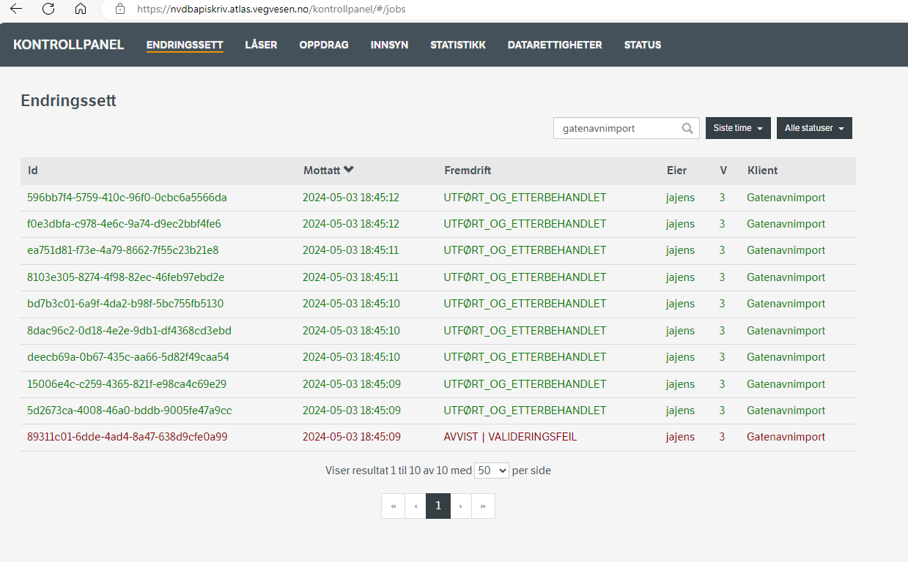

# gateendringer
Python-kode for å generere endringsett med gatenavn. Rekonstruert fra arkiv fra Kartverket.

Overordnet så skal koden sammenligne data fra objekttypen GATE fra NVDB api LES med Kartverkets manus og finne 
hva som bør oppdateres (korrigeres eller registreres?). Sluttresultatet er innsending av endringsett til NVDB api  SKRIV.  

Via angitt YAML konfigurasjonsfil (p.t. `config_prod_v3.yml` ) så konfigurees både generiske python-funksjoner (f.eks logging) og en del variabler som brukes av scriptet `crawl_V2.py`, så som mappenavn, filnavn, lenke til NVDB api og en del andre ting. 

Merk at brukernavnet som står i config-fila blir ignorert: Ved skriving blir du interaktivt spurt om brukernavn og passord i shellet. Hvis det er mer gunstig
å lagre brukernavn og passord i config-fila så er dette selvsagt trivielt å gjøre om på. 

# Kjøring av script på WSL

Først denne kommandoen: 
```bash
python crawl_V2.py -f Adresser_20240429.txt -u gatenavn_ut_20240429 -c config_prod_v3.yml
```
filnavnet bak `-u` parameter velger du fritt, men dette filnavnet skal gjebrukes i neste steg

Merk transaksjonstidspunktet som kommer aller først i output på terminalen: 
```python
{  'sist_oppdatert': '2024-05-03T17:04:41.060955', 
   'sist_prosesserte_transaksjon': {'transaksjonsid': 6395966, 'transaksjonstidspunkt': '2024-05-03T17:04:24', 'indekseringstidspunkt': '2024-05-03T17:04:41'}, 'datakatalog': {'id': 976, 'dato': '2024-03-22', 'versjon': '2.36'}}
```
Transaksjonstidspunkt pluss utfila fra kommandoen over inngår i neste kommando, slik: 
```bash 
python navne_korreksjon_v2.py -f gatenavn_ut_20240429 -c config_prod_v3.yml -t 2024-05-03T17:04:24
```
Du blir nå spurt om ditt SVV brukernavn og passord, dvs det du bruker for å logge inn i APISKRIV. 

Etterpå kan du bruke NVDB skriveapi kontrollpanel for å sjekke om alt gikk gjennom. Klientinformasjon `gatenavnimport` er et greit filter for disse endringssettene. 




### Installasjon med conda environments

Her har jeg prøvd å gjenskape virituelt miljø basert på "pip create" - oppskriften nedenfor (bør unngå pip når du ellers jobber med conda)

```bash
conda create -n gateendring python=3.9 pyyaml clint requests ipykernel 
conda activate gateendring
 ```


 ### Installasjon med pip 

 Har denne (kanskje ikke komplette?) oppskriften - som trolig forutsetter at man har python 3.9 (fra realpython.org?) installert på sin lokale bruker på windows PC. 

 ```
 Pipfile
Request clint
Pyyml (Pyjammel)
(Disse ligger i vanlig PIP)
pipenv install pyyaml   (når en står i C:\Users\<WINDOWSUSER>\AppData\Roaming\Python\Python39\Scripts)
pipenv install clint
pipenv install requests
```

# Wordfil-oppskrift

_Dette er Kartverkets word-fil med notater, trolig satt sammen fra epostdialog kombinert med egne notater:_

~~Gatenavnfila~~ Adressefila (NB! Byttet begrep 2023) må ligge på katalogen en står i:

```
CD C:\Users\<WINDOWSUSER>\AppData\Roaming\Python\Python39\Scripts
pipenv run python crawl_V2.py -f Gatenavn_30052023.txt -u gatenavn_ut_30052023 -c config_prod_v3.yml
```
Endre filnavn i kommandoen over 

(Dette tar ca 5 minutt og analyserer endringer som skjer)

(Ta vare på transaksjonstidspunktet)

```
pipenv run python navne_korreksjon_v2.py 
pipenv run python poll.py –c config_prod_v3.yml
navne_korreksjon_v2.py –h 
```

Skriv inn passord i .yml-fila (YAML)

For å commite:
```
pipenv run python navne_korreksjon_v2.py -f gatenavn_ut_30052023 -c config_prod_v3.yml -t 2023-05-30T12:57:55
```
Endre timestamp i kommandoen over 

Kan kjøres helt til slutt for å få oversikt: 

```
pipenv run poll.py -c config_prod_v3.yml
```

Hvis pip mangler: 

1. Naviger til python-installasjonsmappen under `C:\Program Files\Python-<VERSJON`
1. KJør denne kommandoen: `py -3 -m ensurepip`

